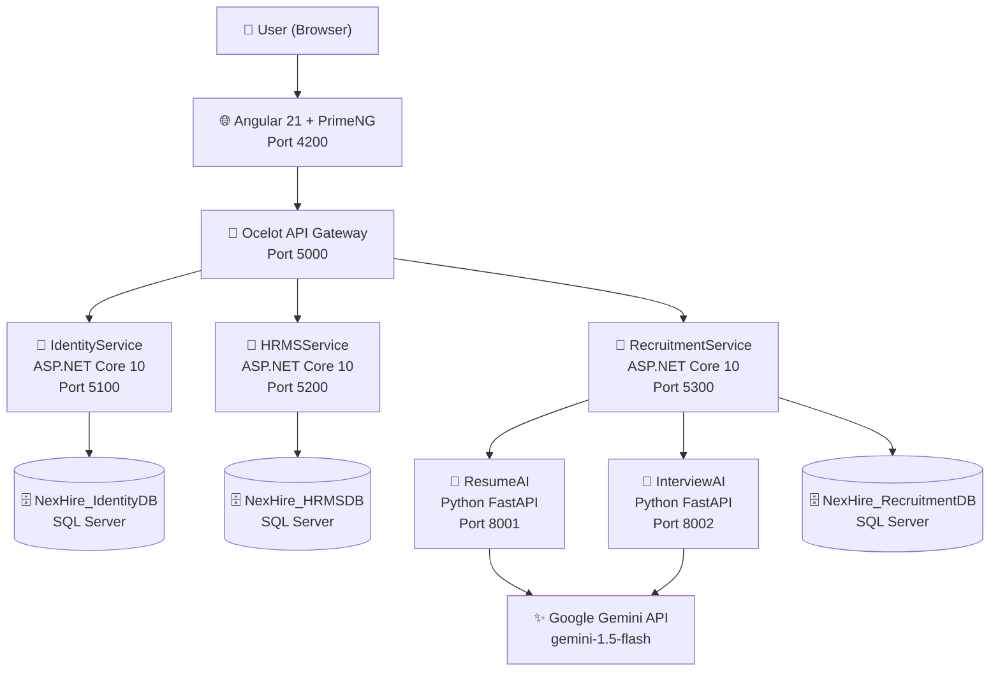

# NexHire Architecture

## System Architecture



## Service Responsibilities

| Service | Port | Responsibility |
|---------|------|----------------|
| Angular Frontend | 4200 | 4 role-based portals (Admin, Manager, HR, Employee) |
| Ocelot Gateway | 5000 | Single entry point, request routing, CORS |
| IdentityService | 5100 | Authentication, JWT token generation, 4 roles |
| HRMSService | 5200 | Employees, Attendance, Payroll, Performance, Onboarding, Analytics |
| RecruitmentService | 5300 | Job postings, applications, AI orchestration |
| ResumeAI | 8001 | PDF extraction, resume screening, candidate ranking |
| InterviewAI | 8002 | Question generation, answer evaluation, performance insights, HR chatbot |

## Clean Architecture (per .NET service)

```
┌─────────────────────────────────────────────┐
│                  API Layer                   │
│         Controllers, Middleware, DI          │
├─────────────────────────────────────────────┤
│              Application Layer               │
│          DTOs, Interfaces, Services          │
├─────────────────────────────────────────────┤
│              Domain Layer                    │
│            Entities, Enums, Rules            │
├─────────────────────────────────────────────┤
│            Infrastructure Layer              │
│       DbContext, EF Migrations, Repos        │
└─────────────────────────────────────────────┘
```

## AI Features

| Feature | Service | Model |
|---------|---------|-------|
| Resume Screening | ResumeAI | Gemini 1.5 Flash |
| Bulk Candidate Ranking | ResumeAI | Gemini 1.5 Flash |
| Interview Question Generator | InterviewAI | Gemini 1.5 Flash |
| Answer Evaluation | InterviewAI | Gemini 1.5 Flash |
| Performance Insights | InterviewAI | Gemini 1.5 Flash |
| HR Policy Chatbot | InterviewAI | Gemini 1.5 Flash |
| Voice Input | Browser | Web Speech API (webkitSpeechRecognition) |

## User Roles & Access

| Role | Dashboard | Modules |
|------|-----------|---------|
| ManagementAdmin | Company-wide analytics, KPIs | All modules read/write |
| SeniorManager | Team attendance, performance | Team management, leave approvals |
| HRRecruiter | HR overview, dept breakdown | Employee CRUD, recruitment pipeline, onboarding |
| Employee | Personal salary, attendance, performance | Self-service, payslips, AI chatbot |

## Data Flow — Resume Screening

```
HR uploads PDF resume
        │
RecruitmentService (ASP.NET)
        │
HTTP POST → ResumeAI (FastAPI, port 8001)
        │
Google Gemini 1.5 Flash API
        │
Returns: match_score, matched_skills, missing_skills, recommendation
        │
Stored in CandidateApplication.AIMatchScore
        │
Displayed in HR portal candidates table
```

## Data Flow — Authentication

```
User submits credentials
        │
Angular → POST /api/auth/login → Ocelot Gateway (5000)
        │
Ocelot routes → IdentityService (5100)
        │
Validates credentials → generates JWT
JWT payload: { userId, email, role, fullName, department }
        │
Angular stores token in localStorage
        │
All subsequent requests include Bearer token
Ocelot passes through to downstream services
Each service validates JWT independently
```

## Docker Network

All services run on the `nexhire-net` bridge network, enabling DNS-based service discovery by container name:
- `sql-server` — SQL Server 2022
- `nexhire-identity` — IdentityService
- `nexhire-hrms` — HRMSService
- `nexhire-recruitment` — RecruitmentService
- `nexhire-gateway` — Ocelot Gateway
- `nexhire-resume-ai` — ResumeAI FastAPI
- `nexhire-interview-ai` — InterviewAI FastAPI
- `nexhire-angular` — Angular (served by nginx)
